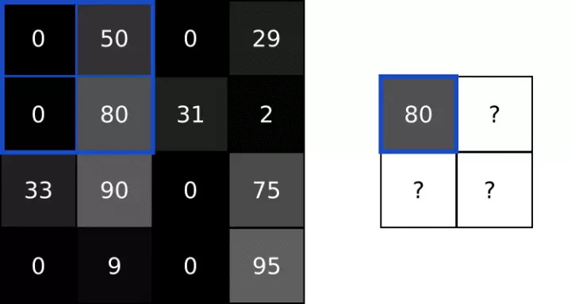

#### 卷积
定义：利用卷积核和数据矩阵中以卷积核同大小的部分点乘，将数据压缩，达到提取出和卷积核特征一致的值。
运算过程：
1、矩阵内积（相同位置上的数相乘）得到新矩阵，就是这样简单粗暴
2、将这个矩阵内部的值相加，得到卷积的结果，放到新矩阵的对应位置

## 池化

## 卷积的作用
用输出图像中更亮的像素表示原始图像中存在的边缘信息，将边缘检测图像用于训练。

## 池化的作用
卷积输出中包含的大部分信息是冗余的，可以通过池化操作减小输入的大小以及输出中相似值的数量。
主要用于特征降维，压缩数据和参数的数量，减小过拟合，同时提高模型的容错性

"C:\Users\zouyo\Desktop\Wallpaper Engine：壁纸引擎.url"