# 一些专业名称

NB-IOT -窄边物联网

RT-Thread -国内的实时操作系统-开源
开源中国：https://my.oschina.net/u/4428324/blog/4623297

# 软件安装

AD-19
链接：https://pan.baidu.com/s/1_H1sMDYtQoCmz43CKHsBig

提取码：2xdz

### 缺少的库

Philips Microcontroller 8-Bit.IntLib
TI Convert Analog to Digital.IntLib
Motorola Power Mgt Voltage Regulator.IntLib
TI Logic Latch.IntLib
ST Memory Non-Volatile RAM.IntLib

可以从立创或是官网找找 -- 尝试过了效果不佳
CSND论坛上的帖：https://blog.csdn.net/weixin_49492286/article/details/120726304

最后，那个最小系统板直接导入就就可以了，它都集成好了

### 软件学习记录

课程是在B站的一电赛的基本电路

可以在德州仪器上查看相应芯片的手册

### 使用技巧

--添加库的方法（集成库和）
    在右下角是有那个小
    可以直接将库的文件移动到安装的library,在进入到设置中安装一下就好

-- 最好每次创建的项目保存好在进行构建

-- 不同项目中的原理图是可以通过拖动的方式使用到其他的PCB工程中

```
UsartInit(); 
while(1);	// 死循环等待串口中断
```

```
你的init是单片机初始化，执行初始化之后，程序执行while(1){};这条语句的意思就是程序到这进入死循环，当有中断响应的时候执行 time这个函数，没有中断响应的时候，cpu一直在while(1){};中等待中断信号。
```

# 第一部分--单片的基础结构

单片机和微型计算机是不同的
8位是指内部总线
内部总线
    RAM -- 256个 这和后面那个寻址很相关
    ROM -- 程序存储器 还有PROM flah等都是程序存储器

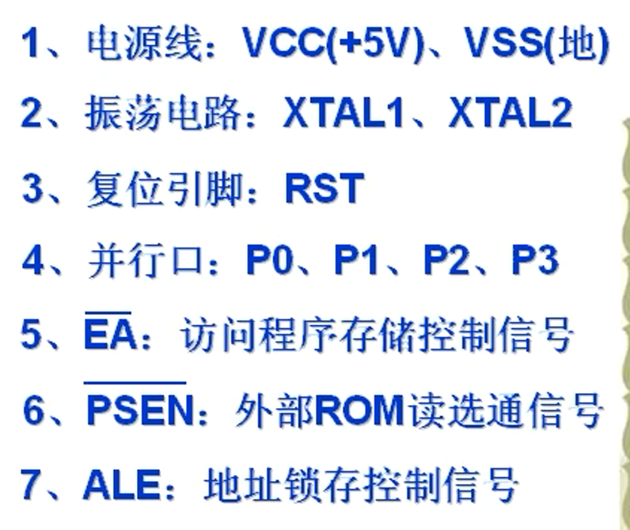

低128位

回顾的知识

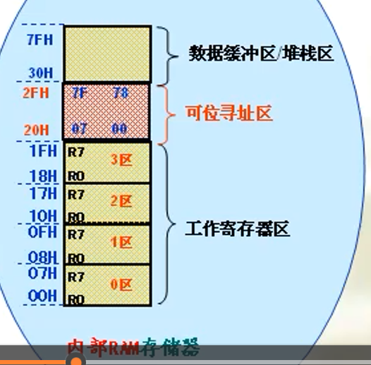

高128位就是AB  P端口 和DPTR等特殊的功能寄存器 80H

#### 各个I/O口的作用

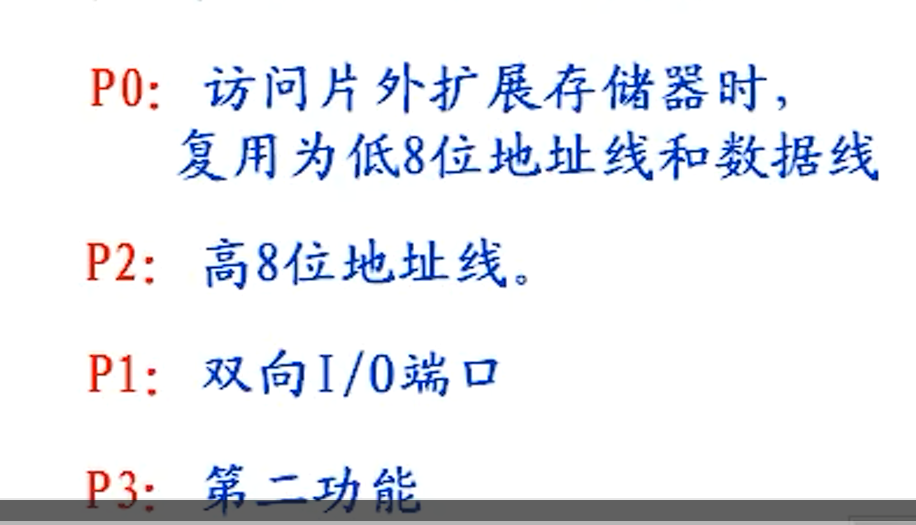

读取任意端口的数据时，需要先将端口置1，在读取状态

单片机一般的结构

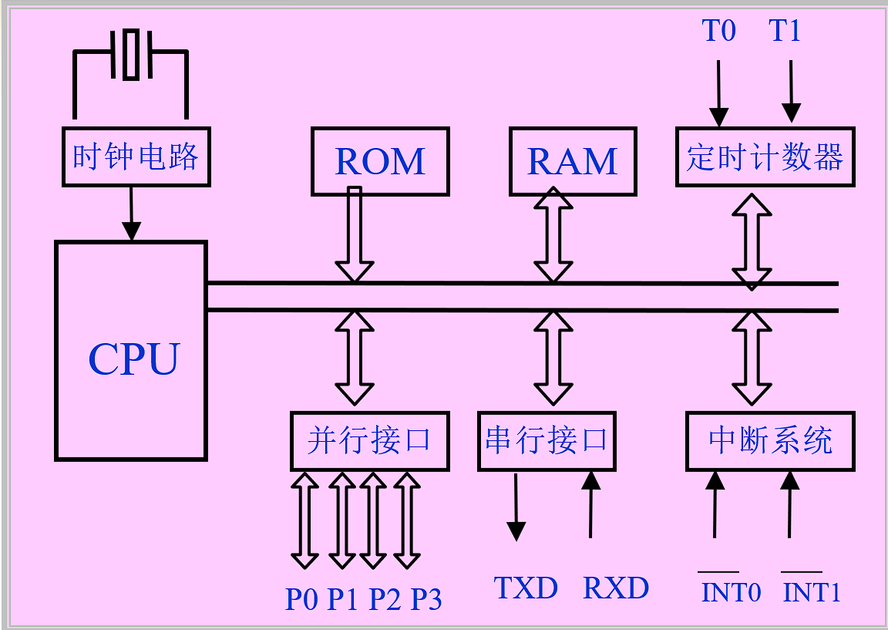

复位电路

左边是上电复位  右边在上电复位和重新复位的功能

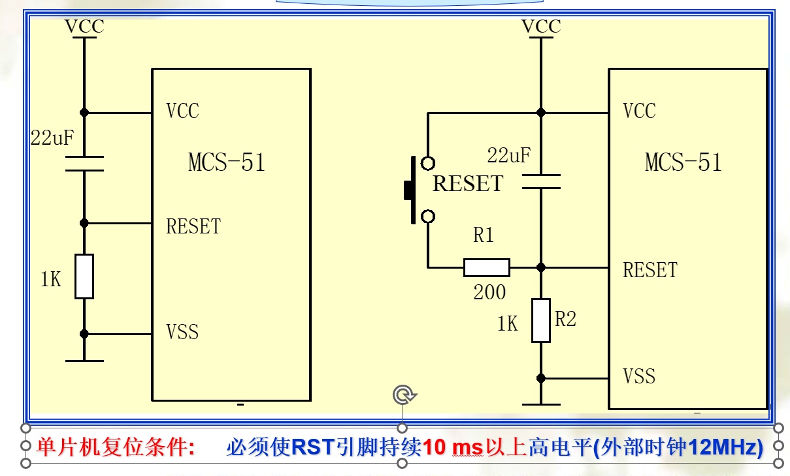

时钟电路

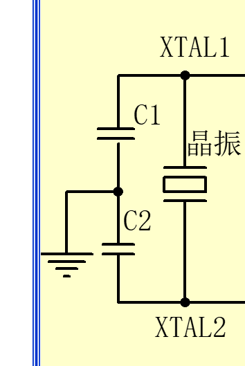

# 第二部分 -- 指令和寻址

51的指令系统 --汇编
指令按照字节计算可以分为三类：单字节 双字节 三字节指令
指令的格式
    标号： 操作码 操作数或是操作的地址; 注释
    实例： DELAY :  MOV 	R3, #0FFH;	延时

## 寻址方式

##### 立即数寻址

在指令中逗号（，）后有#，可以理解为带有给#的即是立即数，就是操作的数据

##### 寄存器寻址

在指令中逗号（，）是寄存器，就是操作寄存器里面的操作数， 例如 ：CLR Rn 就是将某个寄存器清空

##### 直接寻址

在指令中逗号（，）后是地址  例如：	PUSH 20H ,这里的PUSH是压栈

##### 寄存器间接寻址

这种寻址的方式和**P很像。在寄存器中存有地址，我们通过寄存器中的地址去寻址对应的数据 在51中只有R0和R1 DP三个寄存器的以用于这样的方式寻址  例如：MOV A, @R0; 是将R3中的内容作为地址去寻找数据移入累加器A中。

##### 变址寻址

需要寻找数据的地址是两个寄存器中地址的和，一般这连个寄存器一个位变址寄存器，一个基地址寄存器（DP,PC）例如 MOVC A @A+DPTR

##### 相对寻址

应用于转移

##### 位寻址

用在20H-2FH，直接操作位的状态，在20H-2FH这个区间中，将每8位对应其中一个

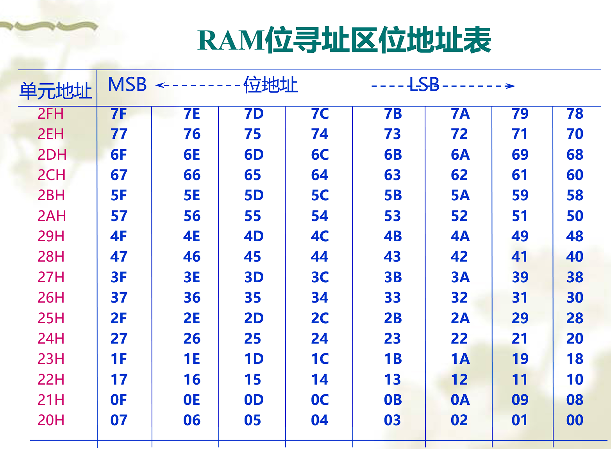

### 小知识点

direct指的是外部ram 内部ram是8位的 外部的ram是16位的

MOV和MOVX C 有X是在外部RAM中操纵 有C是在程序急寄存器

累加器A可作变址寄存器

@Rn（工作寄存器）

@ 可能是将寄存器存入的内容形式

## 指令系统

符号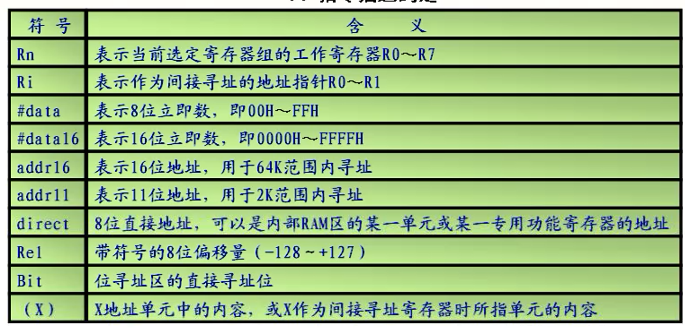

#### 数据传送指令a

MOV -- 内部使用
唯一的十六位传送指令 MOV DPTR #data16

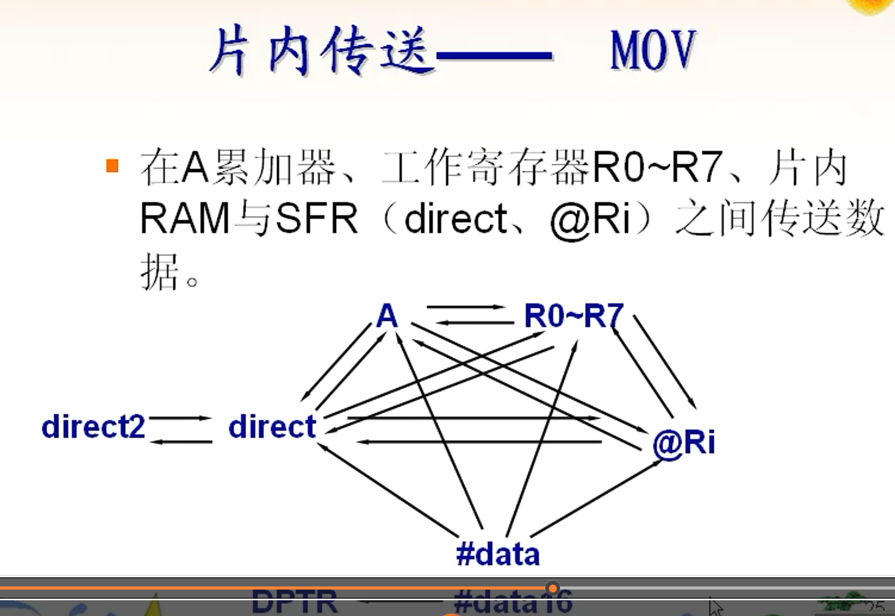
MOVX -- 外部使用
DPTR R0联系ram内外的寄存器

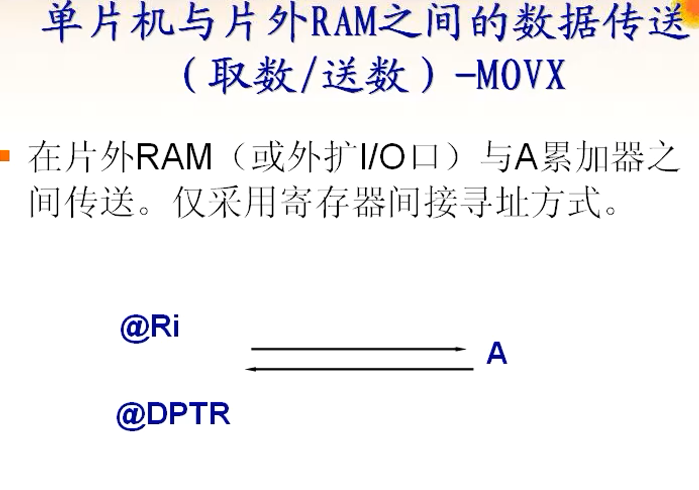
实例:将内部ram值送到外部ram
    MOV A, 30H;
    MOV DPTR, #1000H;
    MOVX @DPTR, A;

MOVC -- ROM

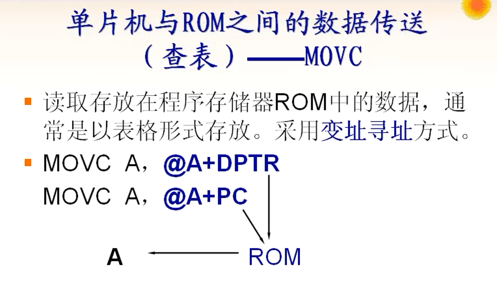

##### 交换类指令

XCH
XCHD 交换低4位
SWAP

##### 堆栈指令

PUSH -- 压栈
POP -- 出栈

只能使用直接寻址的方式

堆栈存在的SP即堆栈指针（栈顶，最开始的地址栈底后续SP会根据你操作栈改变， 存放的是一个地址）

使用场景：保护和恢复现场

#### 运算指令

##### 算术运算

加法
ADD
ADDC -需要加上进位标志，例如：计算16位的，低8位有进位，需要给高8位进位，此时使用ADDC对高8位进行运算

减法
SUBB

乘法
MUL AB 会将结果的十六进制的高8位存放在A 低8位存放在B

除法
DIV AB 这是将商存在A 余数存储在B

实例： 注意B
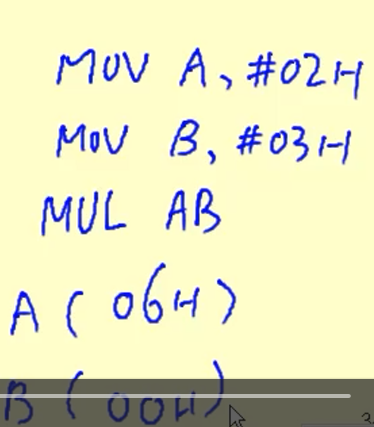

##### BCD-8421码

使用2进制数描述十进制 这个用于数码管
使用4位二进制描述一位十禁止

DA -- 是对BCD码进行修正，跟随在BCD码的加法运算

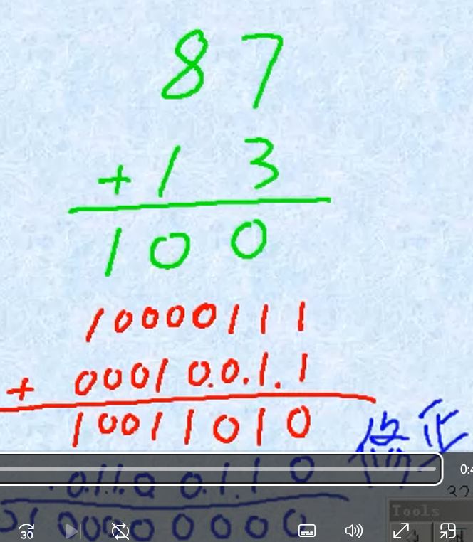

还有加减1

##### 逻辑运算

这种运算与数据的位相关
与或非
ANL
ORL
XRL -- 异或就是两个相同为0 和1相互异或会取反
CLR -- 清0
CPL -- 全部取反，相当于非

##### 循环移动运算

左移动
RL -- 只移动一次
RLC -- 带Cy进位，需要设置好Cy的状态
右移动
RR -- 只移动一次
RRC -- 带Cy进位，需要设置好Cy的状态

##### 无条件转移

长转移
LJMP -- 写法 就是改变PC的位置，改变执行的指令
绝对转
AJMP -- 只能改变11位
相对转
SJMP -- 是根据地址的相差
散转
JMP @A+DPTR 这个常常用于一个按键的转移上，A中存放的按键数值之类

##### 有条件的转移

先判断是否满足条件，改变PC指向我们需要执行的程序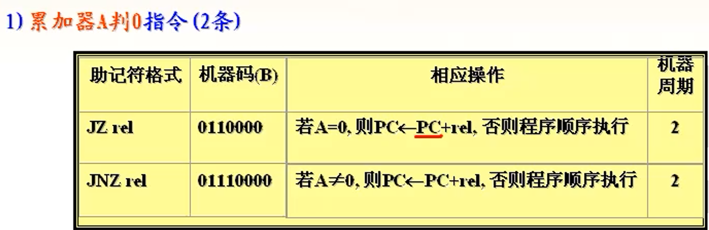

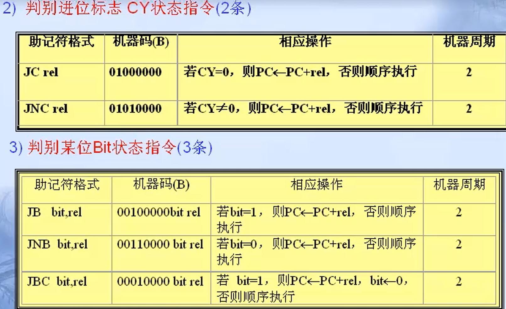

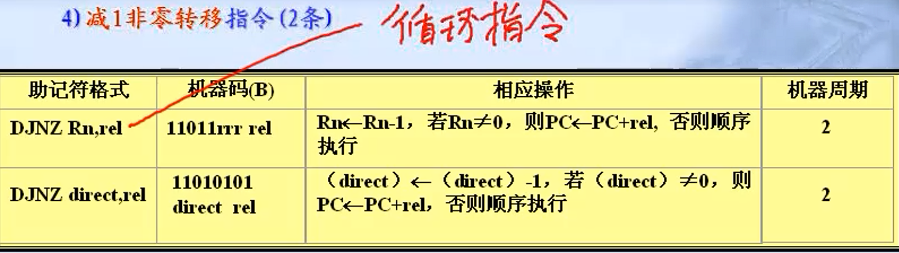

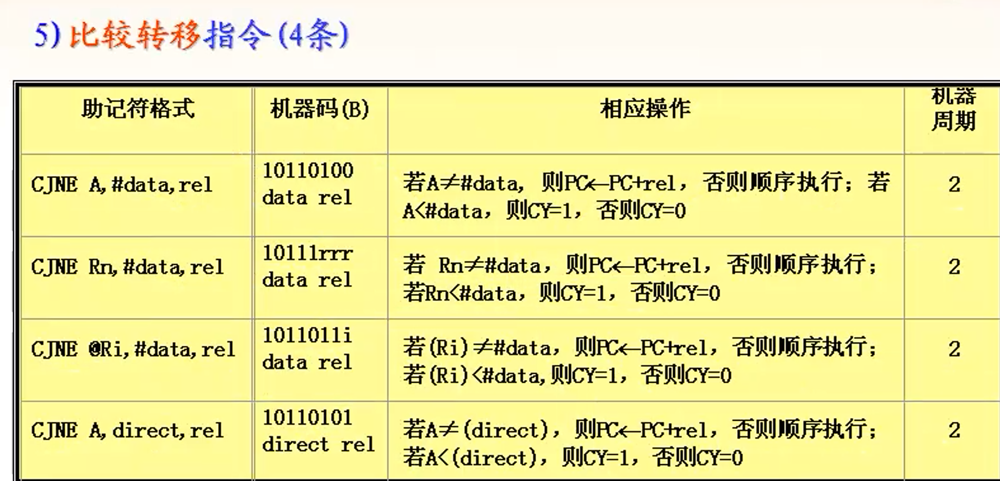

##### 调用指令

绝对 长
ACALL addr11 -- 和转移的区别就是能回到之前的位置
LCALL 64kd的范围

返回
这是和前面两个配合使用

空指令可以用于延时操作

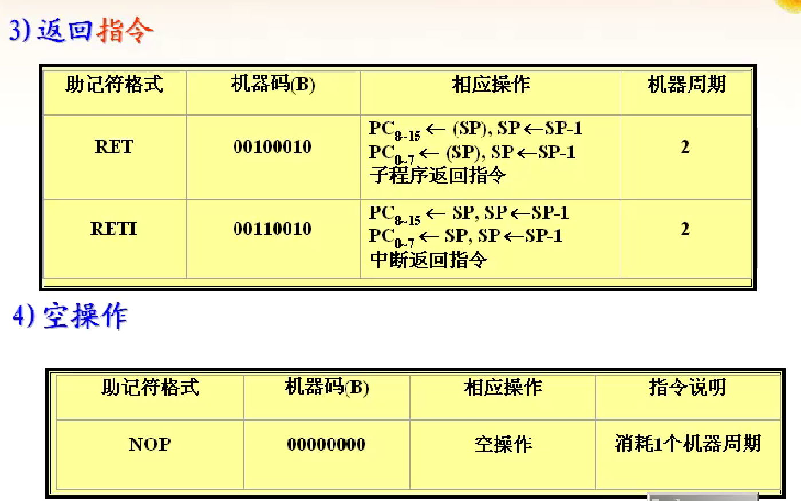

位操作注意C进位标志，它也可以看作一个寄存器，此时为位操作

### 小知识点

非WD和非RD是和读写有关
复位 SP=07H

# 第三部分 -- 汇编程序设计

## 基本的程序结构

需要根据问题分析，给出整体的思路

构建流程图

分配好内存和端口 -- 同PLC的I/O分配

##### 分支程序结构

就是根据条件转移，有点像if else，但是这是每次只有两种情况

使用跳转类的指令会比较多

散转（就是多种情况）-- 有点像switch

    改变PC的位置 JMP @A+DPTR

##### 循环程序结构

案例：延时18

指令周期 -- 机器周期 -- 时钟周期（和晶振的频率有关，倒数）

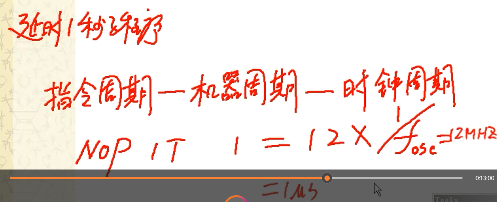

需要注意在延时中使用到的寄存器如在其他代码段有使用会有可能造成一些影响

# 第四部分 定时和中断 PWM

### 定时/计数器

#### 组成

由两个高低八位的寄存器，每个定时器各一个。两个特殊功能寄存器

利用特殊功能寄存器去控制是计数还是定时的功能

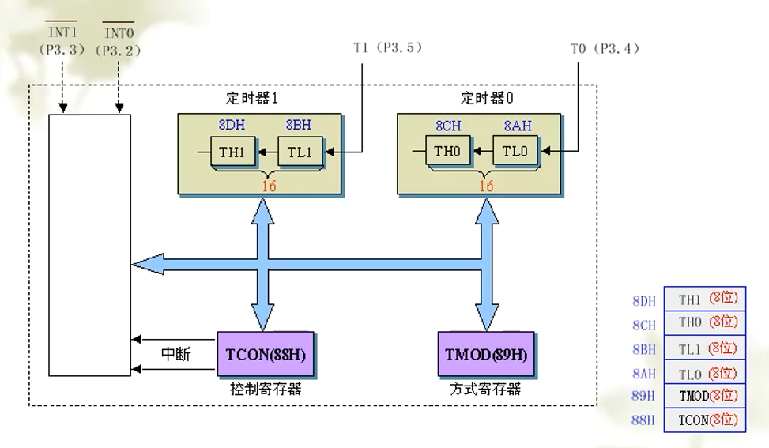

TMOD 是通过设置C/T非控制功能

M1和M0是决定工作方式，有4种 13（高位只有5位） 16 8 8

 GATE 是门控位，决定控制的方式是软还是硬

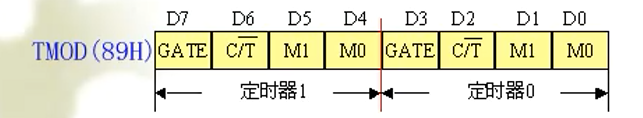

TCON 是 TR是定时  TF是当脉冲计数满了，就会设为1就是对脉冲进行计数

IE 是INT口的中断标志,IT是更改触发方式，是电平触发还是边升沿,TF是定时器触发中断

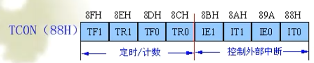

#### 使用

##### 初始化

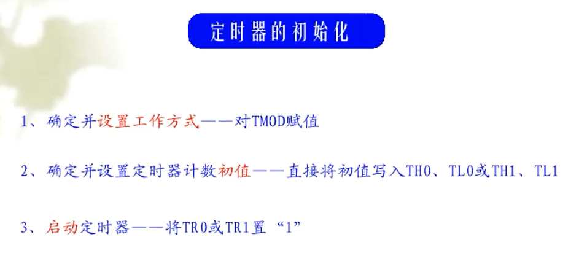

1、是根据场景选择工作方式（M0 和 M1），计数一次的时间是1us

2、要设置初始值，就是定时的时间和工作方式结束的时间差。

3、启动相应的定时器。

### 中断

中断优点：

1. 分时操作 -- 和并发的概念很像，就是宏观上的同时，在cpu内部是分开执行的
2. 实时操作 -- cpu能处理随机事件
3. 故障处理 -- 掉电和溢出

#### 中断源

定时器 1 0，外部io INT非 0 1 （非是低电平有效和下降沿）

串行口（TI RI(在串口的寄存器中 )）

#### 中断允许寄存器 IE

通过0 1控制允许的中断源，1为允许

#### 优先级寄存器 IP

优先级是在中断同时触发时候处理的

在单片机内部是分好的高低级别，但是由于使用了寄存器，我们可以根据需要修改相应的级别顺序。都是同级的优先级，无法相互打断

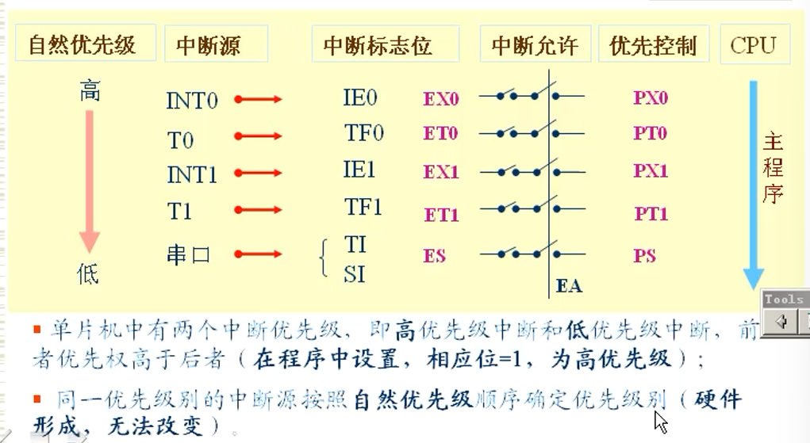

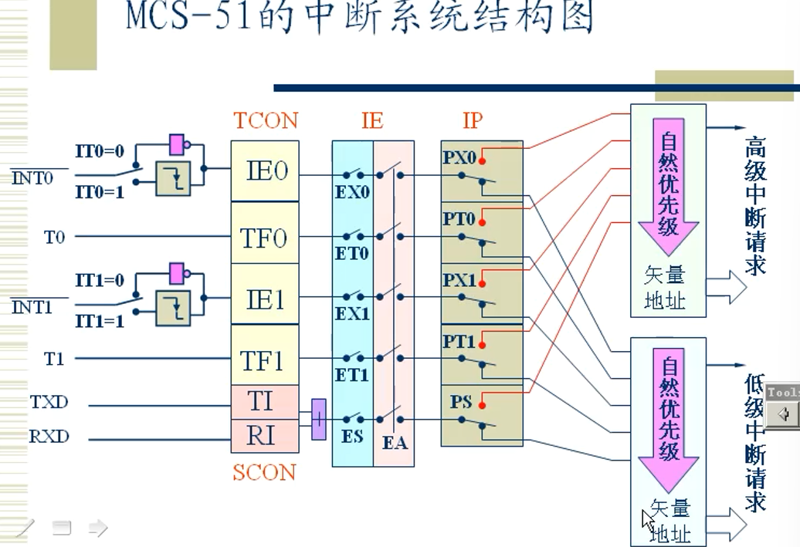

#### 中断响应

中断的响应它是先到一个指定的入口在跳转到需要执行的中断程序入口，这个是有自动完成的，但需要你设置好需要转到的位置。

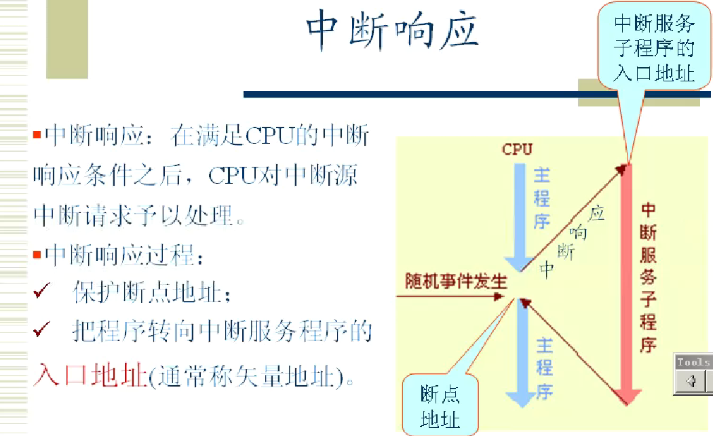

#### 中断处理

这里使用堆栈或是空余空间保护中断程序和主程序中都用到存储区域的数据要保护起来。

例如： 累加器A中内容如果在两个程序中都用到，中断处理就好做好保护

    使用堆栈比较多，PUSH POP

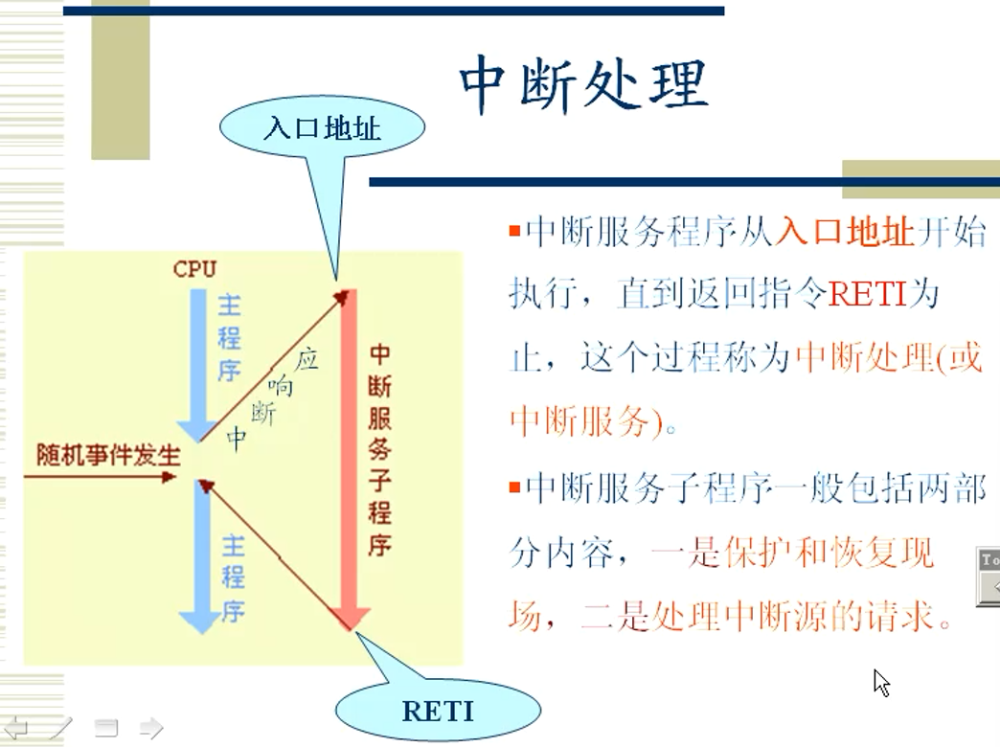

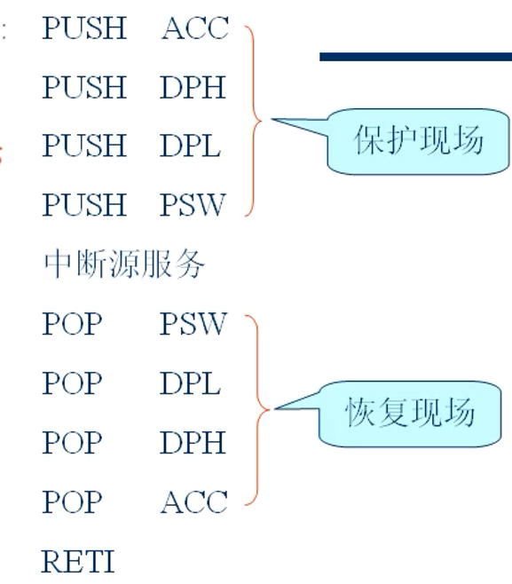

#### 中断返回

就是恢复之前的中断源，不可用RET代替

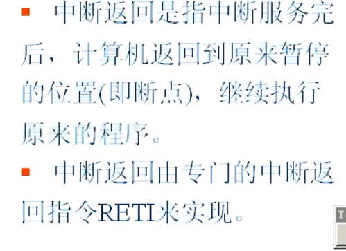


#### 中断撤除

INT非还有在电平触发时候的撤除需要依靠门电路实现

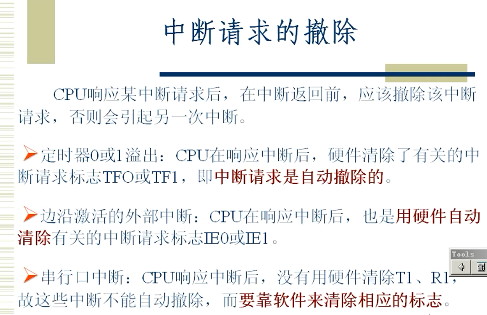

# 第五部分 单片机通信

### 网络通信的知识

串行：就是一位一位的发送，有同异步之分

1. 同步是有共同的时钟线作为保持收发数据的同步
2. 异步是在两个通信的机子间没有约定的时钟，使用各自的时钟作为数据收发

并行：就是一次性发送多位数据

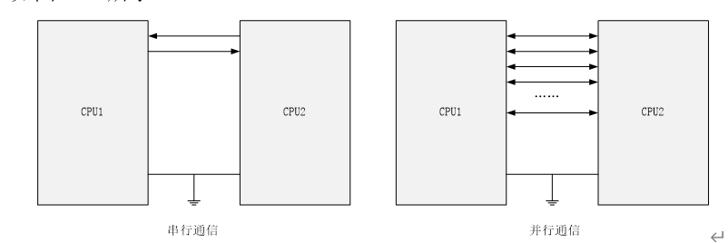

串行工作方式：

1. 单工 ：只可向一方发送
2. 半双工： 可以双方收发，但只通过一条数据线，收发只能交替使用
3. 全双工： 可以双发收发，有两条数据线通道，可以同时收发数据

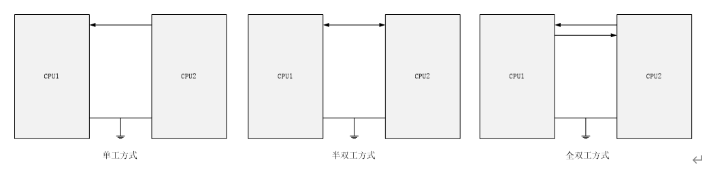

时序： 就是将一个口的多种情况混合在了一起，其实还是高低电平的变化，不过它们之间可以存在相互的联系

### 串口通信

通信可以分为并行和串行

串行就是一位一位去上传，并行就是一次多位传（IIC SPIS），各有优缺点。

TXD -- 传

RXD -- 接

单片机（高低+5 0）<==>PC(高低+12 -12)

波特率就是每秒钟传输的位数

### IIC协议

### SPI协议
