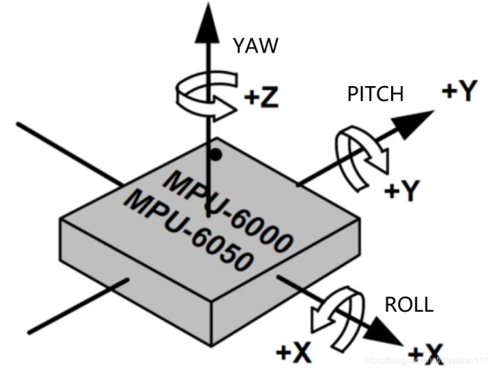

## **陀螺仪**

陀螺仪是用高速回转体的动量矩敏感壳体相对惯性空间绕正交于自转轴的一个或多个轴的角运动检测装置。利用其他原理制成的角运动检测装置起同样功能的也称陀螺仪。它的核心是角动量守恒原理(即当作定轴转动的刚体所受合外力矩为零时，刚体对转轴的角动量恒定不变）。

## **MPU6050模块**

该模块是最为常用的一种三轴陀螺仪、三轴加速度计和温感。可以通过IIC接口输出一个9轴信号(链接第三方数字传感器才可以输出九轴信号，否则只有六轴信号)。通过测角速度和加角加速度的，二者数据通过算法就可以得到x,y,z轴姿态角的变化（横滚角、俯仰角、偏航角）。

