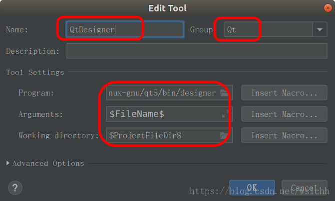
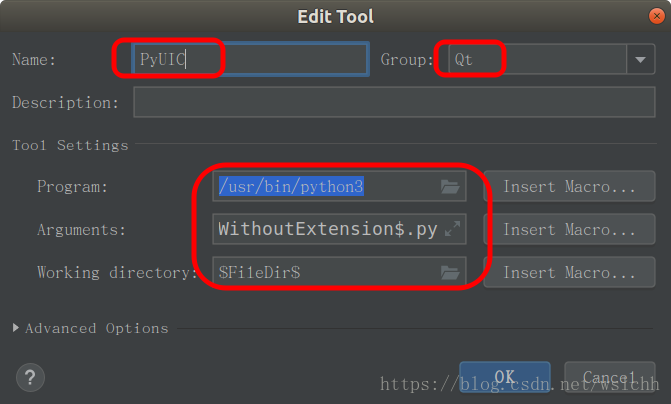
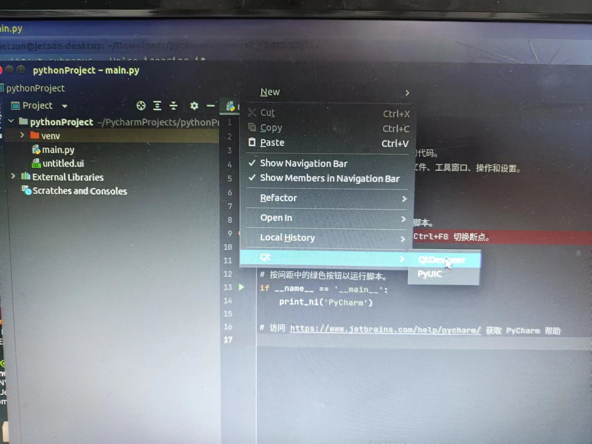

## py-qt5 及 依赖的安装

1、安装pyqt5

```powershell
pip3 install pyqt5 -i https://pypi.douban.com/simple
```

2、安装依赖

```powershell
sudo apt install pyqt5*
```

3、安装Designer

sudo apt install qttools5-dev-tools

## pycharm 安装（注意 是arm 64）

1、由于arm架构需要先安装java环境

```powershell
sudo apt-get install openjdk-11-jdk
```

2、安装完成查看java 版本，可以不用更换环境变量位置

```powershell
java --version
```

3、进入pycharm官网下载arm架构的压缩包

4、通过工具或是命令行解压缩

5、进入bin目录下运行.pycharm.sh

```powershell
cd /Downloads/pycharm-community-2020.3.2/bin
sh ./pycharm.sh
```

6、创建桌面快捷方式（不创建，需要使用5的步骤启动）

首先在cmd通过以下命令创建快捷方式

```powershell
gedit pycharm.desktop
```

按以下内容进行修改和保存

```
[Desktop Entry]
 
Type=Application
 
Name=Pycharm
 
GenericName=Pycharm3
 
Comment=Pycharm3:The Python IDE
 
Exec="/Downloads/pycharm-community-2020.3.2/pycharm-2020.3.2/bin/pycharm.sh" %f
 
Icon=/Downloads/pycharm-community-2020.3.2/pycharm-2020.3.2/bin/pycharm.png
 
Terminal=pycharm
 
Categories=Pycharm;


```

## pycharm配置QtDesigner

1、创建一个空项目，并打开设置

2、在setting中选 Tools下的Extornal Tools，并且点击左上方➕ 

3、按照图片内容添加这两个东西就可以了





4、可以在顶部分鼠标左击选择qt



参考：

[https://blog.csdn.net/FL1623863129/article/details/126004013](https://blog.csdn.net/FL1623863129/article/details/126004013)

